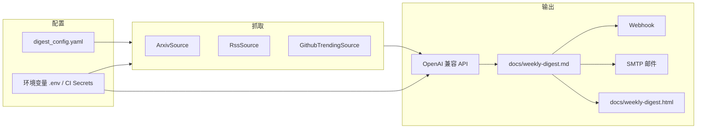

# find_everything 项目说明

本文档基于当前仓库代码整理，描述项目目标、数据流与各模块职责，便于维护与二次开发。

## 1. 项目定位与目标

本项目是一个**自动化技术周报生成器**：从多个公开信息源抓取与关键词相关的条目，将结构化原始数据交给大语言模型（兼容 OpenAI API 的服务端），生成一篇结构固定、适合移动端阅读的 **Markdown 周报**，并可选择写入仓库、发邮件或调用 Webhook 通知。

典型使用场景：

- 定期（如 GitHub Actions 定时任务）生成「Arxiv + RSS 资讯 + GitHub Trending」摘要；
- 通过 YAML 配置订阅源、关键词与时间窗口，无需改代码即可调整抓取范围。

## 2. 端到端流程

1. **加载配置**：读取 `digest_config.yaml`（路径可由环境变量 `DIGEST_CONFIG` 指定），与 `main.py` 内 `DEFAULT_DIGEST_CONFIG` 做深度合并。
2. **确定时间窗口**：由 `digest_sources/date_range.py` 的 `build_digest_date_window` 根据配置与环境变量计算 Arxiv `submittedDate` 区间及人可读起止日期。
3. **多源抓取**：按 `digest_sources/__init__.py` 中 `DEFAULT_SOURCES` 注册顺序依次抓取，拼接成带区块标题的纯文本，供模型阅读。
4. **AI 汇总**：`summarize_with_ai` 使用固定提示词约束输出 Markdown 结构与字数。
5. **落盘与分发**：写入 `docs/weekly-digest.md` 与同内容渲染的 `docs/weekly-digest.html`；若配置了 SMTP 或 `WEBHOOK_URL` 则发送通知；`save_and_commit` 还会执行 `git add/commit/push`（适合在 CI 中自动推回仓库）。

## 3. 目录与模块职责

| 路径 | 说明 |
|------|------|
| `main.py` | 入口：配置合并、日期窗口、调度各源、调用 AI、保存与通知。 |
| `digest_config.yaml` | 用户可编辑的订阅与关键词配置。 |
| `digest_sources/__init__.py` | 注册 `DEFAULT_SOURCES` 抓取顺序；新增信息源时在此追加。 |
| `digest_sources/base.py` | `FetchContext`（共享上下文）、`DigestSource` 抽象基类。 |
| `digest_sources/arxiv.py` | Arxiv：支持 **HTTP API** 与 **arxiv Python 库** 两路，可配置首选与自动回退；支持多组关键词合并去重。 |
| `digest_sources/rss.py` | RSS/Atom：多订阅源、按标题关键词过滤、全局条数上限。 |
| `digest_sources/github_trending.py` | 抓取 GitHub Trending 页面 HTML，可选 GitHub REST API 补全 Star/Fork/语言。 |
| `digest_sources/config_helpers.py` | 关键词组解析、RSS 与旧版 `rss_feeds` / `rss_max_items` 兼容合并。 |
| `digest_sources/date_range.py` | 数据窗口：`preset`（day/week/month）、绝对 `start`/`end`、环境变量覆盖。 |
| `digest_sources/util.py` | 日志、`tqdm` 进度条、带重试的 `requests` Session。 |
| `.github/workflows/weekly-digest.yml` | 定时运行 `python main.py` 的 CI 工作流。 |
| `demo.py` | 与主流程无关的 `arxiv` 库示例脚本，可忽略或作本地试验。 |

## 4. 信息源实现要点

### 4.1 Arxiv（`ArxivSource`）

- 查询形如：`all:(关键词) AND submittedDate:[YYYYMMDD0000 TO YYYYMMDD2359]`，其中 **`TO` 两侧必须有空格**，否则官方 API 可能返回 500（代码中含规范化与注释说明）。
- `backend`：`api`（直接请求 `export.arxiv.org` + `feedparser`）或 `library`（`arxiv` 包分页与限速）。配置项只决定**先试哪一路**，另一路在失败或结果不可用时自动切换。
- `keywords` 可为字符串（单组检索）或 YAML 列表（多组独立检索后按论文链接去重）；可选 `max_results_total` 限制合并后总条数。
- 超时可通过环境变量 `ARXIV_CONNECT_TIMEOUT`、`ARXIV_READ_TIMEOUT` 调整（API 路径）。

### 4.2 RSS（`RssSource`）

- 使用 `get_rss_section` 合并新版 `rss` 块与旧版顶层 `rss_feeds`、`rss_max_items`，保持向后兼容。
- 每条 feed 可为 URL 字符串或 `{ url, keywords? }`；关键词解析顺序：**单条 keywords → `rss.keywords` → 全局 `keywords`**。
- 匹配逻辑：将关键词按逗号拆成若干子串，**子串包含于标题（小写）即命中**（简单包含匹配，非分词）。

### 4.3 GitHub Trending（`GithubTrendingSource`）

- 用 `BeautifulSoup` 解析 `github.com/trending` 页面（URL 可配置，如 `?since=weekly`）。
- `api_enrich` 为 true 时，对解析出的 `owner/repo` 调用 `api.github.com/repos/{repo}` 获取 Star/Fork/语言；可使用 `GITHUB_TOKEN` 或 `GH_TOKEN` 提高速率限制。
- 配置中的 `keywords` **不参与 HTML 筛选**，仅通过 `keyword_context` 传给模型，便于在周报叙述中侧重某些技术方向。

## 5. 配置说明

### 5.1 `digest_config.yaml`（节选语义）

- **`keywords`**：全局默认关键词（各源未单独指定时使用）。
- **`date_range`**：
  - `preset`: `week` | `day` | `month`（相对**执行当日**计算窗口，详见 `date_range.py` 注释）。
  - 或同时提供 `start`、`end`（`YYYY-MM-DD` 或 `YYYYMMDD`）使用固定区间。
- **`arxiv` / `rss` / `github_trending`**：各块均支持 `enabled` 开关及各自字段；细节见仓库内 YAML 行内注释。

### 5.2 环境变量（常用）

| 变量 | 作用 |
|------|------|
| `DIGEST_CONFIG` | 自定义 YAML 配置文件路径。 |
| `DIGEST_DATE_START` / `DIGEST_DATE_END` | 同时设置时覆盖一切日期逻辑，强制使用自定义区间。 |
| `DIGEST_DATE_PRESET` | `week` / `day` / `month`（及别名），覆盖配置文件中的 preset。 |
| `KEYWORDS` | 覆盖配置文件中的全局 `keywords`（若非空）。 |
| `OPENAI_API_KEY` | LLM 调用密钥。 |
| `OPENAI_API_BASE` | API 基地址（默认 OpenAI 官方）。 |
| `AI_MODEL` | 模型名，默认 `gpt-4o-mini`。 |
| `SMTP_SERVER`, `EMAIL_USER`, `EMAIL_PASS`, `RECIPIENT_EMAIL` | 四者齐全则发送 HTML 邮件。 |
| `WEBHOOK_URL` | POST JSON 通知（内容格式见 `main.py`，需与接收方约定）。 |
| `GITHUB_REPOSITORY` | Webhook 文案中拼接 raw 链接时使用（CI 自动注入）。 |
| `TQDM_DISABLE` | 设为 `1` 可在 CI 中关闭进度条。 |

本地开发可将上述变量写入 `.env`，由 `python-dotenv` 在启动时加载。

## 6. AI 输出与落盘

- 提示词要求模型输出三个固定板块：**Arxiv 前沿论文**、**优质资讯/论坛**、**GitHub 热门仓库**，并强调 GitHub 项需体现 Star/Fork（及语言若有）。
- `docs/weekly-digest.html` 使用内联 CSS，面向窄屏阅读。
- `save_and_commit` 会修改全局 git 用户名为 `github-actions[bot]` 并 push；在本地手动运行需注意是否希望自动推送。

## 7. CI（GitHub Actions）

工作流 `.github/workflows/weekly-digest.yml`：

- 定时：每周五 12:00 UTC（注释中说明对应北京时间晚间）。
- 支持 `workflow_dispatch` 手动触发。
- `permissions: contents: write` 以便推送 `docs/` 更新。
- 通过 `secrets` / `vars` 注入 API Key、SMTP、Webhook、`KEYWORDS`、`AI_MODEL` 等。

## 8. 依赖与运行时

- Python 依赖见 `requirements.txt`：`requests`、`PyYAML`、`feedparser`、`arxiv`、`beautifulsoup4`、`openai`、`markdown`、`python-dateutil`、`python-dotenv`、`tqdm` 等；其中 `httpx` 版本区间与 `openai` 版本在文件中有兼容性注释。
- 运行：`python main.py`（需在项目根目录或正确设置路径，以便找到默认 `digest_config.yaml`）。

## 9. 扩展建议

- **新增信息源**：实现 `DigestSource` 子类（`section_key`、`fetch`、`format_for_prompt` 等），在 `DEFAULT_SOURCES` 中注册。
- **调整周报结构**：修改 `main.py` 中 `summarize_with_ai` 的提示词（会直接影响 Markdown 板块与风格）。

---

*文档与仓库代码同步整理；若行为与本文不符，以实际代码为准。*
